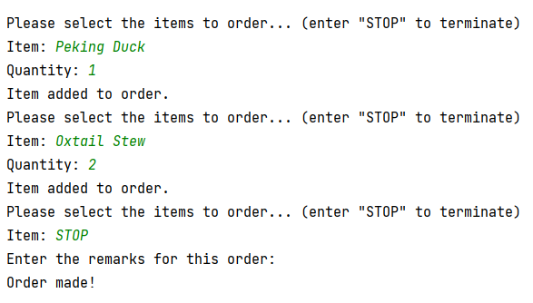

# 1. Introduction
**Hotel Reservation and Payment System (HRPS)** is an application designed for hotel 
administrators to manage reservations of hotel rooms and orders of room service. 
The application covers the key features such as making hotel reservations, recording orders, and viewing records. 

This report covers our design considerations including object-oriented concepts, design principles and patterns, as well as our assumptions made when building this system. 
We also include feature description for user-friendliness, and UML diagrams for displaying the interactions and relationships among objects. Additionally, test cases are also well-presented 
to ensure that our application can meet certain requirements and constraints.
# 2. Design Considerations

## 2.1. Approach
In this project, **OOP** concepts are used comprehensively in both design and implementation. We also take immutability and information hiding into consideration in most classes to ensure safety.

We follow the **layerd (n-tier) architecture** which utilizes the **model–view–controller (MVC)** design pattern. 
The code is set up so that data enters at the top layer and works its way down through each layer until it reaches the bottom. 
Each layer has a distinct task along the route. 
In our application, the top layer **UI** classes receives commands from users and work dependently on **controller** classes, which manipulates the operations of **entity** class and **data storage**.

## 2.2. Object-Oriented Concepts

## 2.3. Design Principles

# 3. Assumptions made
Each **contact number** can only be registered for one guest.
Room is not created individually by UI, instead, when a new room is built, its data must be manually written to the 
RoomData.txt file.
# 4. Features introduction (User Guide)

## 4.1. functionalities

## 4.2. user friendliness

When we are selecting mulitple entries during check out and updating order status, instead of 
letting the user to key in lengthy details about check out or an order that a room made, we 
allow the user to select the index number of listed items.

(Give examples here)

# 5. UML diagram display

## 5.1. Class Diagram

## 5.2. Sequence Diagram

# 6. Test cases

## 6.1 Functionalities and User friendliness

### 6.1.1 Guest
| feature             |  user input | result display  
:-------------------------:|:-------------------------:|:-------------------------:
|add a new guest|  |  
|update a guest's details| |

### 6.1.2 Reservation
#### 6.1.2.1 Add a reservation
| feature             |  user input | result display
:-------------------------:|:-------------------------:|:-------------------------:
|add a reservation from a new guest|  |  
|add a reservation from an existing guest|   |  

#### 6.1.2.2 Update a reservation
| feature             |  user input 
:-------------------------:|:-------------------------:
|search for a reservation to update by guest contact|  
|search for a reservation with non-existing guest contact|  

#### 6.1.2.3 update reservation status
| feature             |  user input | result display
:-------------------------:|:-------------------------:|:-------------------------:
|confirm a pending reservation|  |  
|cancel a waitlisted reservation|   |  
|check in a confirmed reservation|   |  
|cancel a confirmed reservation (customer does not check in by time)|   |  
|check out a checked in reservation|   |  

### 6.1.3 Room
#### 6.1.3.1 Create all rooms
| feature             |  user input | result display
:-------------------------:|:-------------------------:|:-------------------------:
create all rooms| |

#### 6.1.3.2 Check room's status
| feature             |  user input | result display
:-------------------------:|:-------------------------:|:-------------------------:

#### 6.1.3.3 Update room's details
| feature             |  user input | result display
:-------------------------:|:-------------------------:|:-------------------------:
|update room's rate| |
|maintain room||

### 6.1.4 Room service order
#### 6.1.4.1 Entering order services
| feature             |  user input | result display
:-------------------------:|:-------------------------:|:-------------------------:
|select items for order|  |
|check & update order's status||

#### 6.1.4.2 Create/Update/Remove room service menu items
| feature             |  user input | result display
:-------------------------:|:-------------------------:|:-------------------------:
|create menu items||
|update menu items||
|remove menu items||

## 6.2 Negative cases

### 6.2.1 Guest
| feature             |  user input | result display
:-------------------------:|:-------------------------:|:-------------------------:
|add a guest with contact existing in system|   |  
|invalid credit card number|   |  

### 6.2.2 Reservation
| feature             |  user input | result display
:-------------------------:|:-------------------------:|:-------------------------:
|invalid room/bed type input|   |  

#7. Learning point and reflection